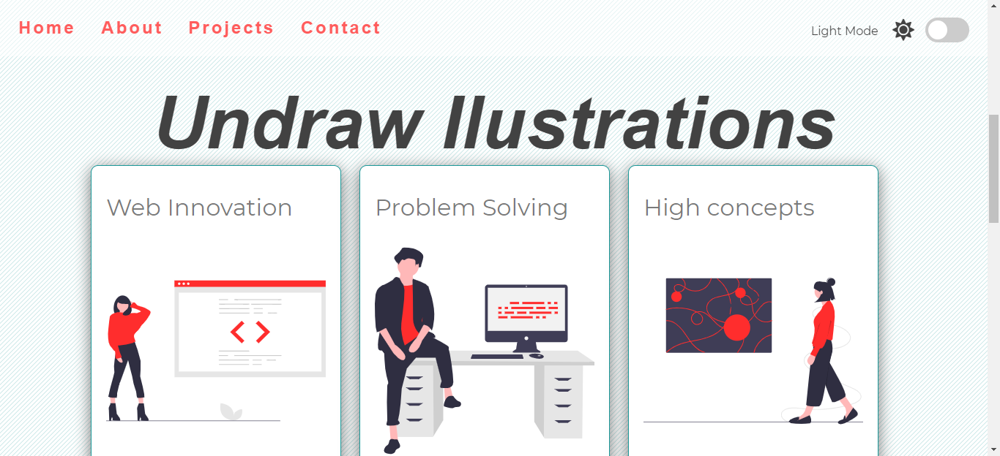
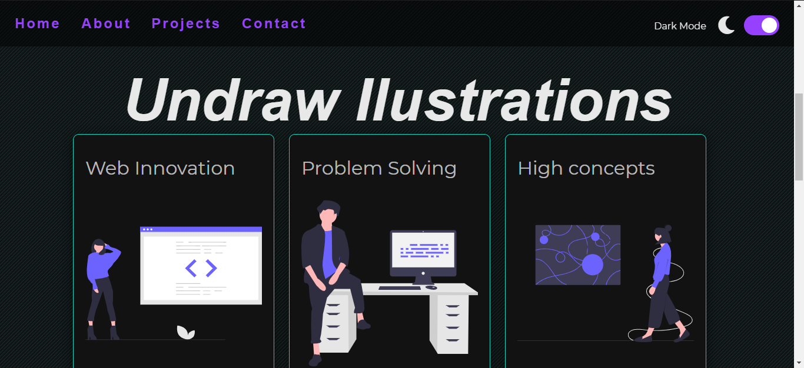

# templete-light-dark-mode
This project is a template that you can to use for do your own page with light and dark mode. This project has a page where you will find a multiple sections such as home, about, projects and contact. You are free use it and modify whatever you want. 

## Objetive 
The objetive of this app is practies and leanr more about javascript, html and css.

## Illustrations

## Motivation for this project
This project came from a course in udemy [JavaScript Web Projects: 20 Projects to Build Your Portfolio](https://academy.zerotomastery.io/p/javascript-projects). 
You can to learn a lots with this course about javascript .  I encourage you to check it.

## Online tools
* [Hero Patterns](https://www.heropatterns.com/) -Background
* [Undraw](https://undraw.co/illustrations) -Illustrations
* [Fontawesome](https://fontawesome.com/) -Icons

## Deployment
Project [view](https://nestornavarro.github.io/templete-light-dark-mode/)

